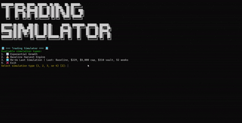

<p align="center">
  
</p>

# Trading Simulator

A comprehensive Python application featuring two distinct trading simulation engines: **Exponential Growth** and **Baseline Harvest Engine**. Perfect for analyzing different investment strategies and risk management approaches.

## 🚀 Features

- **Two Simulation Types**: Choose between compound growth or harvest-based strategies
- **Dynamic Start Date**: Simulations automatically start from the current week's Monday
- **Interactive CLI**: Colorful, user-friendly command-line interface
- **Parameter Persistence**: Save and re-run previous simulations instantly
- **Comprehensive Reporting**: Weekly breakdowns, monthly summaries, and charts
- **Professional Output**: Text reports and matplotlib visualizations
- **Extensible Architecture**: Clean, modular design for easy enhancement

## 📊 Simulation Types

### 1. Exponential Growth Simulator
- **Strategy**: Pure compound interest growth
- **Formula**: `A = P(1 + r)^n`
- **Use Case**: Traditional investment growth modeling
- **Risk Profile**: High growth potential with compounding

### 2. Baseline Harvest Engine
- **Strategy**: Accumulation phase → Distribution phase
- **Phases**: Build to cap → Harvest excess profits
- **Use Case**: Risk-managed trading with profit extraction
- **Risk Profile**: Controlled growth with systematic withdrawals

## 🏗️ Architecture

For a detailed view of the application architecture, see [architecture/architecture.md](architecture/architecture.md).

To regenerate the architecture diagram:

```bash
python architecture/generate_architecture.py
```

## 📦 Installation

1. **Prerequisites**: Python 3.8+
2. **Virtual Environment** (recommended):
   ```bash
   python -m venv .venv
   # Windows:
   .venv\Scripts\Activate.ps1
   # macOS/Linux:
   source .venv/bin/activate
   ```
3. **Install Package**:
   ```bash
   pip install -e .
   ```

## 🎯 Usage

### Start the Simulator
```bash
start-simulator
```

### Direct Execution
```bash
python -m simulator.main
```

### Clear Output Directory
```bash
clear-output
```

### Re-run Last Simulation
Choose option `3` from the main menu to instantly re-run your previous simulation with saved parameters.

## ⚙️ Simulation Parameters

### Start Date Logic
The simulation automatically determines its start date based on the current day:
- **Weekdays (Mon-Fri)**: Starts from the most recent Monday
- **Weekends (Sat-Sun)**: Starts from the upcoming Monday

*Example: If today is Sunday 1/11, simulation starts Monday 1/12. If today is Wednesday 1/08, simulation starts Monday 1/05.*

### Common Parameters
- `initial_pot`: Starting investment amount (default: $1,000)
- `total_weeks`: Simulation duration in weeks (default: 52)

### Exponential Growth Parameters
- `weekly_return_rate`: Annual return rate as decimal (default: 0.25 = 25%)

### Baseline Harvest Engine Parameters
- `weekly_return_rate`: Weekly return rate (default: 0.25 = 25%)
- `engine_cap`: Maximum pot size before distribution (default: $10,000)
- `growth_vault_pct`: Vault allocation during growth phase (default: 50%)
- `harvest_vault_pct`: Vault allocation during harvest phase (default: 25%)

## 📈 Exponential Growth Simulation

**Strategy Overview:**
- Continuous compound growth
- No profit extraction during simulation
- Focus on long-term capital appreciation

**Example Parameters:**
- Initial Amount: $1,000
- Weekly Return: 25%
- Duration: 52 weeks

**Expected Outcome:**
- Final Amount: ~$1,000 × (1.25)^52
- Growth Focus: Pure capital accumulation

## 🌾 Baseline Harvest Engine Simulation

**Strategy Overview:**
- **Phase 1 (Accumulation)**: Reinvest all profits until reaching engine cap
- **Phase 2 (Distribution)**: Lock pot at cap, systematically withdraw excess profits
- **Risk Management**: No withdrawals during deficit periods

**Key Rules:**
1. **Starting Point**: Begin with initial investment
2. **Growth Phase**: 100% reinvestment until engine cap reached
3. **Harvest Phase**: Excess profits split between vault and spending
4. **Deficit Protection**: No distributions if pot falls below cap
5. **50/50 Split**: Withdrawals divided equally between savings and spending

**Example Parameters:**
- Initial Amount: $220
- Weekly Return: 25%
- Engine Cap: $10,000
- Duration: 52 weeks

**Typical Results:**
- **Engine Hit**: Week 18 (when pot reaches $10,000)
- **Final Pot**: $10,000 (locked)
- **Total Vault**: $43,606.23 (accumulated savings)
- **Total Spend**: $43,606.23 (available for spending)

## 📊 Output Formats

Each simulation generates:

### Text Report (`simulation.txt`)
- Weekly breakdown with dates
- Monthly summary tables
- Final statistics
- Parameter summary

### Chart (`plot.png`)
- Time series visualization
- Multiple data streams (pot, vault, spend)
- Professional matplotlib styling

### Directory Structure
```
output/
└── run_exponential_2026-01-10_14-30-45/
    ├── simulation.txt
    └── plot.png
```

## 🔧 Technical Details

### Dependencies
- `numpy`: Numerical computations
- `matplotlib`: Chart generation
- `colorama`: Cross-platform terminal colors
- `pytest`: Testing framework

### Architecture Components
- **CLI Layer**: User interface and input handling
- **Simulation Engine**: Core algorithms for both strategies
- **Data Processing**: Report generation and time series analysis
- **File Management**: Output organization and parameter persistence

### File Structure
```
trading_simulator/
├── src/simulator/
│   ├── main.py           # CLI interface and orchestration
│   └── simulation.py     # Core simulation algorithms
├── tests/
│   └── test_simulation.py # Comprehensive test suite
├── architecture/
│   ├── generate_architecture.py
│   └── architecture.md
├── output/               # Generated reports and charts
├── demo/                 # Demo files and media
└── pyproject.toml       # Project configuration
```

## 🤝 Contributing

1. Fork the repository
2. Create a feature branch
3. Add tests for new functionality
4. Ensure all tests pass
5. Submit a pull request

## 📄 License

This project is open source. See LICENSE file for details.

---

**Built with ❤️ for educational and analytical purposes**