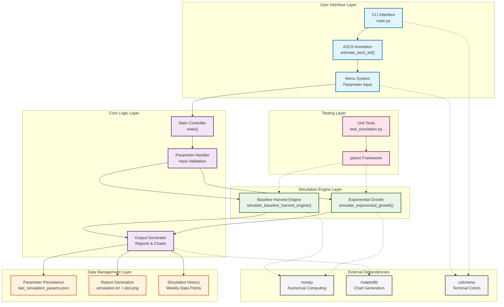

# Trading Simulator Architecture

This document contains a visual representation of the Trading Simulator's architecture using Mermaid.js.

## Architecture Overview

The Trading Simulator is a Python-based application that provides two types of trading simulations:
- **Exponential Growth**: Compound interest-based growth simulation
- **Baseline Harvest Engine**: Accumulation and distribution phase simulation with vault allocation

## Architecture Diagram



## Key Components

### User Interface Layer
- **CLI Interface**: Command-line interface with colored output
- **ASCII Animation**: Welcome banner display
- **Menu System**: Interactive parameter input with validation

### Core Logic Layer
- **Main Controller**: Application flow orchestration
- **Parameter Handler**: Input validation and default value management
- **Output Generator**: Report and chart generation

### Simulation Engine Layer
- **Exponential Growth**: Compound interest calculations
- **Baseline Harvest Engine**: Multi-phase simulation with growth/harvest logic

### Data Management Layer
- **Parameter Persistence**: JSON-based configuration saving
- **Report Generation**: Text and graphical output
- **Simulation History**: Time-series data storage

### Testing Layer
- **Unit Tests**: Comprehensive test coverage for all algorithms
- **pytest Framework**: Test execution and reporting

### External Dependencies
- **numpy**: Numerical computing for calculations
- **matplotlib**: Chart generation and visualization
- **colorama**: Cross-platform colored terminal output

## Data Flow

1. User selects simulation type via CLI menu
2. Parameters are collected and validated
3. Simulation runs using appropriate algorithm
4. Results are processed and formatted
5. Output is generated (console, text file, chart)
6. Parameters are saved for future re-runs

## File Structure

```
trading_simulator/
├── src/simulator/
│   ├── main.py              # CLI interface and main logic
│   └── simulation.py        # Core simulation algorithms
├── tests/
│   └── test_simulation.py   # Unit tests
├── architecture/
│   └── generate_architecture.py  # This script
├── output/                  # Generated reports and charts
├── pyproject.toml          # Project configuration
└── last_simulation_params.json  # Parameter persistence
```

## Usage

To regenerate this architecture diagram, run:

```bash
python architecture/generate_architecture.py
```

Or for detailed view:

```bash
python architecture/generate_architecture.py --detailed
```

Generated on: 2026-01-11 00:14:23
